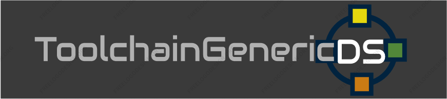

NTR/TWL SDK: TGDS1.65

master: Development branch. Use TGDS1.65: branch for stable features.

This is the ToolchainGenericDS Woopsi ZLIB Compression project:

1.	Compile Toolchain:
To compile this project you will need to follow the steps at https://bitbucket.org/Coto88/toolchaingenericds :
Then simply extract the project somewhere.

2.	Compile this project: 
Open msys, through msys commands head to the directory your extracted this project.
Then write:
make clean <enter>
make <enter>

After compiling, run the example in NDS. 

Project Specific description:
A Woopsi UI + TGDS SDK template for UI control handling on the NintendoDS. 
Draw the pop up windows across the screen or scroll other windows to test touchscreen. 
Also plays WAV/AD-PCM (Intel) files from the directory!

- Also allows to decompress multiple files within a .ZIP of any size. 
  May be slower on slower ASIC slot-1 cards or if the DLDI driver is unoptimized.

Note: UI Controls experimental.

/release folder has the latest binary precompiled for your convenience.

Latest stable release: https://bitbucket.org/Coto88/ToolchainGenericDS-zlib-example/get/TGDS1.65.zip

Coto